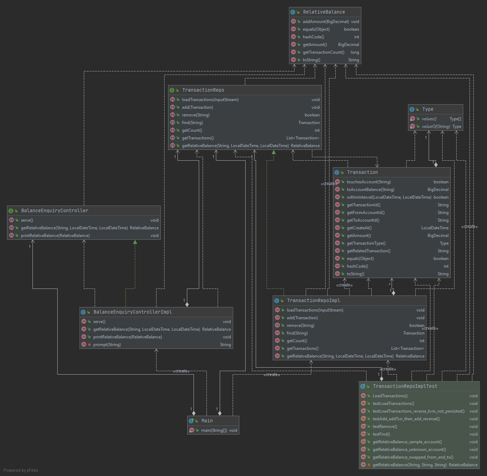
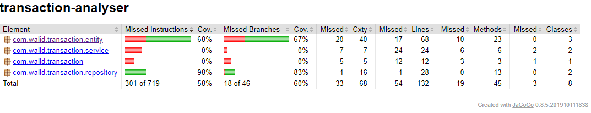

# Transaction Analyser

## Overview
This is a java 8 based exercise, although simple but still demonstrates a modular and possibly extensible multitiered design.

## Main Features
- application is initialised on startup with transaction records from a CSV file presented as commandline argument.
- interactive command line interface to submit queries and retrieve summary results.

## Main Technology Choices
- Multitiered design (frontend controller, data tier consisting of a handful of entity beans and a repository tier in the middle between the controller and the data entities) 
- Gralde used to manage dependencies and generate the uber JAR.
- JaCoCo used to measure and generate test coverage report.
- Junit used to create Unit/Integration tests.

## UML Class Diagram


## Synopsis
To build (package) the uber JAR
```bash
$ ./gradlew build
```
To run the application
```bash
$ java -jar build/libs/transaction-analyser-1.0.0.jar startupTransactions.csv
AccountId?
>ACC334455
From?
>20/10/2018 12:00:00
To?
>20/10/2018 19:00:00
Relative balance for the period is: -$25.00
Number of transactions included is: 1
===================================

AccountId?
>:q

$
```

## Test Coverage Report
